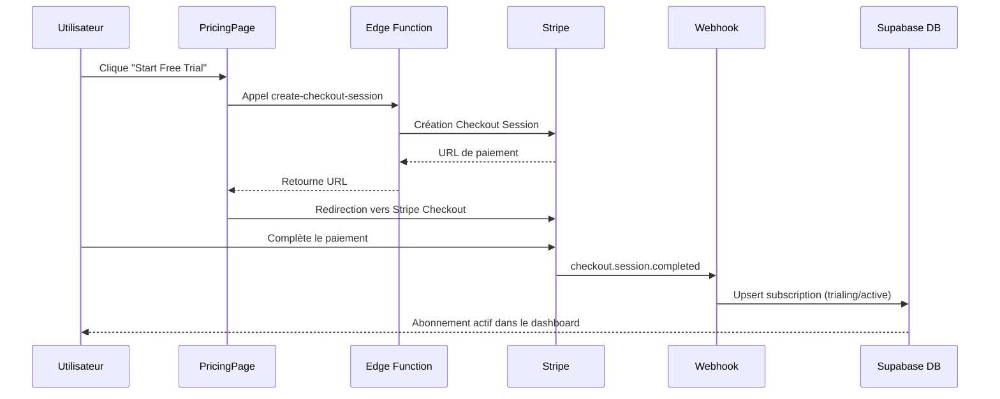

# 🔧 Instructions Stripe — Produits & Prix à Configurer

Ce guide vous explique exactement quels produits et prix créer dans votre **Dashboard Stripe**, puis quels secrets configurer dans **Supabase** pour que le système d'abonnement fonctionne.

---

## Étape 1 : Créer les Produits dans Stripe

Allez dans votre [Dashboard Stripe](https://dashboard.stripe.com) → **Products** → **+ Add Product**

> [!IMPORTANT]
> Créez chaque produit exactement comme décrit ci-dessous. Les noms et prix sont importants.

### Produit 1 : 7-Day Pass
| Champ | Valeur |
|-------|--------|
| **Nom** | `NestureAI 7-Day Pass` |
| **Description** | Full access for 7 days. One child profile. |
| **Prix** | `$9.99` |
| **Facturation** | `Recurring` → `Weekly` |
| **Type** | `Subscription` |

### Produit 2 : Premium (Monthly)
| Champ | Valeur |
|-------|--------|
| **Nom** | `NestureAI Premium` |
| **Description** | Everything you need to support your child. One child profile. |
| **Prix** | `$29.99` |
| **Facturation** | `Recurring` → `Monthly` |
| **Type** | `Subscription` |

### Produit 3 : Family (Monthly)
| Champ | Valeur |
|-------|--------|
| **Nom** | `NestureAI Family` |
| **Description** | One plan for the whole family. Unlimited child profiles. |
| **Prix** | `$49.99` |
| **Facturation** | `Recurring` → `Monthly` |
| **Type** | `Subscription` |

### Produit 4 : Annual Family (Yearly)
| Champ | Valeur |
|-------|--------|
| **Nom** | `NestureAI Annual Family` |
| **Description** | Best value for families. Unlimited child profiles. Save up to 20%. |
| **Prix** | `$499.00` |
| **Facturation** | `Recurring` → `Yearly` |
| **Type** | `Subscription` |

---

### (Optionnel) Prix supplémentaires pour le toggle Yearly

Si vous souhaitez que le toggle "Yearly" sur la page de tarification fonctionne avec des prix annuels spécifiques pour Premium :

### Produit 5 : Premium (Yearly) — Optionnel
| Champ | Valeur |
|-------|--------|
| **Nom** | `NestureAI Premium Yearly` |
| **Description** | Premium plan billed annually. Save 20%. |
| **Prix** | `$287.88` |
| **Facturation** | `Recurring` → `Yearly` |

---

## Étape 2 : Récupérer les Price IDs

Après avoir créé chaque produit, Stripe vous donne un **Price ID** qui commence par `price_`. Par exemple :
```
price_1QxAbCdEfGhIjKlMnO
```

Notez chaque Price ID à côté du produit correspondant.

---

## Étape 3 : Configurer les Secrets Supabase

Allez dans votre [Dashboard Supabase](https://supabase.com/dashboard) → **Edge Functions** → **Secrets** (ou **Settings** → **Edge Functions** → **Manage secrets**)

Ajoutez les secrets suivants :

| Secret Name | Valeur | Description |
|---|---|---|
| `STRIPE_SECRET_KEY` | `sk_test_...` ou `sk_live_...` | Votre clé secrète Stripe |
| `STRIPE_WEBHOOK_SECRET` | `whsec_...` | Le secret du webhook Stripe |
| `STRIPE_PRICE_7DAY_PASS` | `price_xxx...` | Price ID du 7-Day Pass |
| `STRIPE_PRICE_PREMIUM` | `price_xxx...` | Price ID du Premium Monthly |
| `STRIPE_PRICE_FAMILY` | `price_xxx...` | Price ID du Family Monthly |
| `STRIPE_PRICE_ANNUAL_FAMILY` | `price_xxx...` | Price ID de l'Annual Family |
| `STRIPE_PRICE_PREMIUM_YEARLY` | `price_xxx...` | *(Optionnel)* Price ID du Premium Yearly |
| `CLIENT_URL` | `https://votre-domaine.com` | L'URL de votre app (pour les redirections) |

> [!TIP]
> Si vous utilisez Stripe en mode test, les clés commencent par `sk_test_` et `pk_test_`. En production, utilisez `sk_live_` et `pk_live_`.

---

## Étape 4 : Configurer le Webhook Stripe

1. Allez dans [Stripe Dashboard](https://dashboard.stripe.com) → **Developers** → **Webhooks** → **+ Add Endpoint**
2. **URL du Endpoint** : 
   ```
   https://mkcmpgusdxagvbjianpo.supabase.co/functions/v1/stripe-webhook
   ```
3. **Événements à écouter** (sélectionnez tous ceux-ci) :
   - `checkout.session.completed`
   - `customer.subscription.created`
   - `customer.subscription.updated`
   - `customer.subscription.deleted`
   - `invoice.payment_failed`
4. Après avoir créé le webhook, copiez le **Signing Secret** (`whsec_...`) et ajoutez-le comme secret Supabase sous le nom `STRIPE_WEBHOOK_SECRET`.

---

## Étape 5 : Exécuter la Migration SQL

Exécutez le fichier de migration dans le **SQL Editor** de Supabase pour mettre à jour la table `subscriptions` :

```sql
-- Copier-coller le contenu du fichier :
-- supabase/migrations/20260818_update_subscriptions_plans.sql
```

> [!WARNING]
> Exécutez cette migration **après** avoir déployé les Edge Functions mises à jour.

---

## Étape 6 : Déployer les Edge Functions

```bash
supabase functions deploy create-checkout-session
supabase functions deploy stripe-webhook
```

---

## Résumé des Flux



---

## Tester en Mode Développement

Utilisez les **cartes de test Stripe** :

| Carte | Numéro | Résultat |
|-------|--------|----------|
| ✅ Succès | `4242 4242 4242 4242` | Paiement réussi |
| ❌ Refusée | `4000 0000 0000 0002` | Paiement refusé |
| 🔄 3D Secure | `4000 0025 0000 3155` | Authentification requise |

**Date d'expiration** : N'importe quelle date future (ex: `12/34`)  
**CVC** : N'importe quel nombre à 3 chiffres (ex: `123`)
